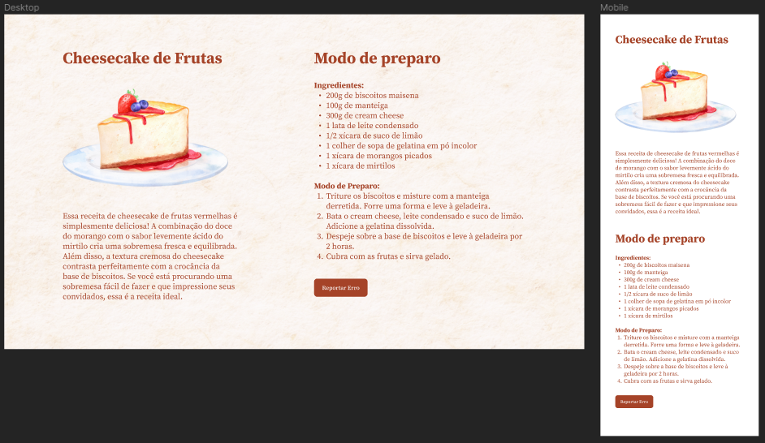

<h1 align="center"> Cheesecake Recipe </h1>

Um site para que eu possa mostrar como você pode fazer um Cheesecake.

  <a href="#-tecnologias">Tecnologias</a>&nbsp;&nbsp;&nbsp;|&nbsp;&nbsp;&nbsp;
  <a href="#-projeto">Projeto</a>&nbsp;&nbsp;&nbsp;

 

  

## 🚀 Tecnologias

Esse projeto foi desenvolvido com as seguintes tecnologias:

- HTML e CSS
- Git e Github

## 💻 Projeto

- [Acesse o projeto finalizado, online](https://walderwilliam.github.io/Cheesecake_recipe/)
